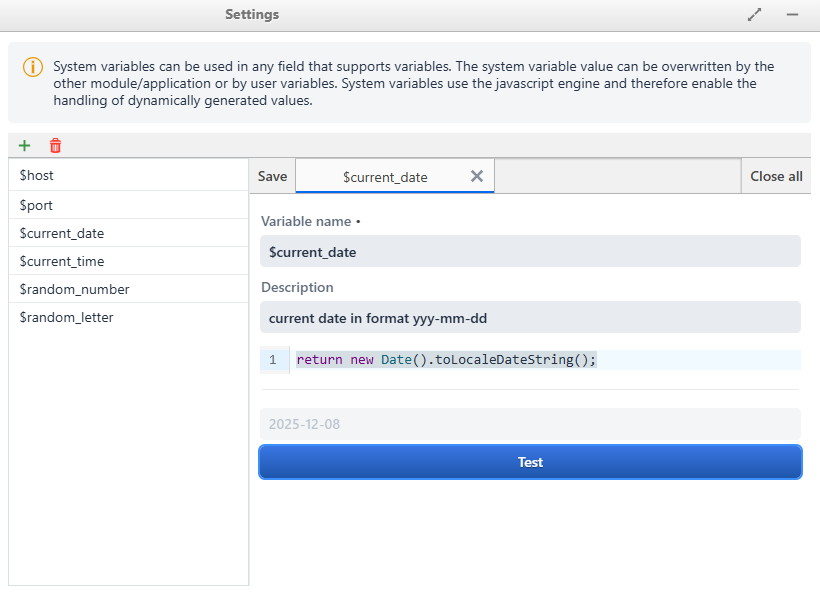
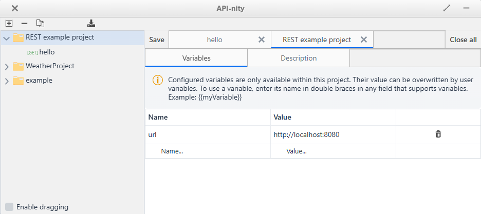
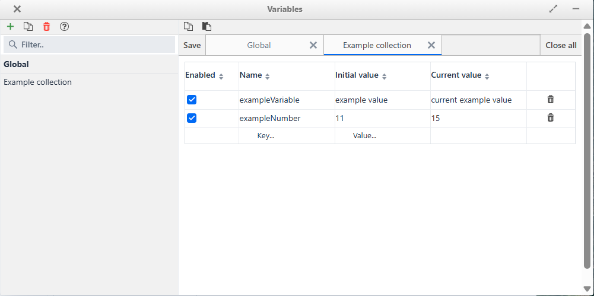
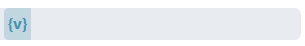
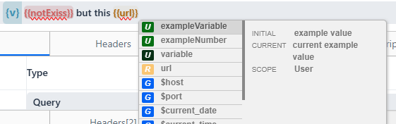
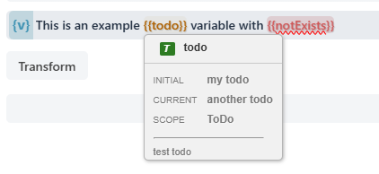
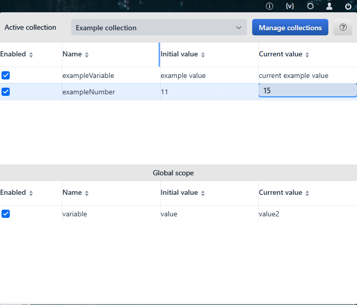

# Variables

Variables are a **core feature of the PacOS application**.  
They are not tied to any specific plugin, but are available system-wide and can be used across all modules, including Mock Servers.

---

## Variable Groups and Priority

Variables are divided into three groups, ordered by priority (from lowest to highest):

1. **System variables**
    - Static or auto-generated values based on JavaScript.
    - Always start with the `$` prefix to indicate they belong to the system.
    - Configured in: **Applications → Settings → System Variables**.
    - Can return both static values and dynamically calculated results.

2. **Plugin variables**
    - Configurable at the plugin/module level (if supported).
    - Can override system variables.

3. **User variables**
    - Divided into two sections:
        - **Collection variables** – users can create as many collections of variables as needed.
        - **Global variables** – one distinguished collection available system-wide.
    - User variables can override plugin and system variables.
    - Global variables have the highest priority and can override all other variable types.
    - Configured in: **Applications → Variables**.

---

## Using Variables

- Variables can be used in any field that explicitly supports them.
- Such fields display a **variable icon prefix** before the input box.



- Variables are inserted using **double curly braces**: ```{{myVariable}}```
- To open the variable suggestion window:
-- Use the keyboard shortcut **Ctrl+Space**, or
-- Type the curly brace `{` to trigger the suggestions automatically.



:::tip[Hover preview]  
When hovering the mouse over a variable inside a field that supports variables, a **modal window** will appear showing the **current value of the variable**.  
This preview reflects the value that will be used during form processing.
:::

---

## Editing and Managing Variables

- **System variables** – configured in system settings, support JavaScript for dynamic values.
- **Plugin variables** – configured directly in plugins (if supported).
- **User variables** – managed in the Variables module.
- The application provides a default **Global collection** for user that can be modified.
- Users can create and add their own collections.
- Variable tables support **copy/paste** operations using **Ctrl+C / Ctrl+V**.
- Variables can be added or edited directly in tables by double-clicking on a row.

---

## Quick Editing

The system provides quick access to variable management,
Expand the **context menu of variables** by clicking the variable icon ```{v}```in the top-right corner of the screen.
From there, you can:
- Switch the currently active user collection.
- Override the current value of a variable.



---

##  Persistence

- **Global user variables** and **collection user variables** are stored separately for each user session.
- Guest accounts do not have access to the variable system.

---

## Structure

The Core Variables system provides:
1. **System variables** – lowest priority, prefixed with `$`.
2. **Plugin variables** – configurable at module level, override system variables.
3. **User variables** – highest priority, divided into collections and global.
4. **Quick editing menu** – accessible via the variable icon in the top-right corner.
5. **Copy/paste support** – manage variables efficiently with keyboard shortcuts.